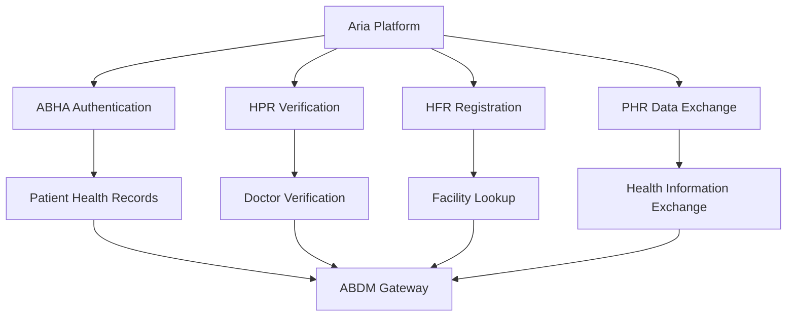

## What is ABDM?

The Ayushman Bharat Digital Mission (ABDM) is India's national digital health ecosystem, launched by the Government of India to create a comprehensive digital health infrastructure. ABDM aims to connect patients, healthcare providers, and health programs through digital highways.

<Info>
ABDM is managed by the National Health Authority (NHA) under the Ministry of Health and Family Welfare.
</Info>

## ABDM Building Blocks

ABDM consists of several core components that work together to create an interoperable health ecosystem:

### 1. ABHA (Health ID)

- Unique 14-digit health identifier for every Indian citizen
- Links all health records across providers
- Enables seamless access to medical history

### 2. Healthcare Professionals Registry (HPR)

- Verified registry of healthcare professionals
- Unique HPR ID for doctors and health workers
- Ensures authenticity of medical practitioners

### 3. Health Facility Registry (HFR)

- Comprehensive database of health facilities
- Unique facility IDs for hospitals and clinics
- Enables facility verification and discovery

### 4. Personal Health Records (PHR)

- Patient-controlled health data repository
- Stores prescriptions, lab reports, and medical history
- ABHA-linked for secure access

<Note>
Aria integrates with all four ABDM building blocks to provide a complete digital health solution.
</Note>

## Aria's ABDM Integration Architecture



## Key Integration Features

### Patient Health Records Management

Aria leverages ABDM's PHR system to provide:

<Steps>
  <Step title="Unified Health Locker">
    All patient records stored in ABHA-linked health locker accessible across providers
  </Step>
  
  <Step title="Consent-based Access">
    Doctors request patient consent before accessing health records
  </Step>
  
  <Step title="Real-time Sync">
    Prescriptions and reports automatically synced to patient's PHR
  </Step>
  
  <Step title="Interoperability">
    Records can be shared with any ABDM-compliant healthcare provider
  </Step>
</Steps>

### Healthcare Provider Verification

Aria validates healthcare professionals through HPR:

- **Automatic Verification**: Doctor credentials verified against HPR database
- **Trust Indicators**: Verified doctors display HPR badges
- **Compliance**: Ensures only registered practitioners can prescribe

### Facility Integration

Healthcare facilities using Aria are registered in HFR:

- **Facility Discovery**: Patients can find ABDM-registered facilities
- **Authenticated Prescriptions**: Prescriptions linked to verified facilities
- **Network Effects**: Join the nationwide digital health network

## Standards and Compliance

### FHIR (Fast Healthcare Interoperability Resources)

Aria uses FHIR standards for health data exchange:

```json
{
  "resourceType": "Prescription",
  "id": "example-prescription",
  "status": "active",
  "patient": {
    "reference": "Patient/abha-12-3456-7890-1234"
  },
  "medicationCodeableConcept": {
    "coding": [{
      "system": "http://snomed.info/sct",
      "code": "123456",
      "display": "Medication Name"
    }]
  }
}
```

<Info>
FHIR ensures that health data is structured consistently across all ABDM-compliant systems.
</Info>

### Data Privacy and Security

ABDM integration follows strict privacy regulations:

- **Consent Framework**: Patient consent required for every data access
- **Purpose Limitation**: Data access restricted to specific medical purposes
- **Audit Trails**: Complete logging of all data access events
- **Encryption**: End-to-end encryption for data transmission
- **Data Minimization**: Only necessary health information is shared

<Warning>
ABDM compliance requires strict adherence to data protection regulations including the Digital Personal Data Protection Act (DPDP).
</Warning>

## Health Information Exchange Workflow

### Sharing Medical Records

<Steps>
  <Step title="Patient Consultation">
    Patient visits doctor for consultation with ABHA ID
  </Step>
  
  <Step title="Consent Request">
    Doctor requests access to patient's medical history through Aria
  </Step>
  
  <Step title="Patient Approval">
    Patient receives consent request and approves via mobile app
  </Step>
  
  <Step title="Data Retrieval">
    Aria fetches health records from ABDM network using FHIR APIs
  </Step>
  
  <Step title="Clinical Decision">
    Doctor reviews complete medical history and makes informed decisions
  </Step>
  
  <Step title="Prescription Sync">
    New prescription automatically synced to patient's ABHA health locker
  </Step>
</Steps>

### Cross-Provider Continuity

When a patient visits a different healthcare provider:

1. Patient shares ABHA ID with new provider
2. New provider requests historical records through ABDM
3. Patient grants consent for specific records
4. Provider accesses prescriptions from previous consultations
5. Seamless care continuity without manual record transfer

## Benefits of ABDM Integration

### For Healthcare Providers

<CardGroup cols={2}>
  <Card title="Reduced Documentation" icon="file-lines">
    Digital records eliminate paperwork and manual data entry
  </Card>
  
  <Card title="Better Outcomes" icon="heart-pulse">
    Access to complete medical history improves diagnosis and treatment
  </Card>
  
  <Card title="Interoperability" icon="arrows-turn-to-dots">
    Seamlessly exchange data with any ABDM-compliant system
  </Card>
  
  <Card title="Regulatory Compliance" icon="shield-check">
    Built-in compliance with national health data standards
  </Card>
</CardGroup>

### For Patients

- **Ownership**: Complete control over personal health data
- **Accessibility**: Medical records accessible from anywhere
- **Portability**: Move between healthcare providers without losing history
- **Transparency**: Know who accessed your health data and when
- **Security**: Bank-grade security for sensitive health information

### For the Healthcare System

- **Data-Driven Insights**: Anonymous health data for public health research
- **Reduced Duplication**: Eliminate redundant tests and procedures
- **Cost Efficiency**: Lower healthcare costs through better coordination
- **Universal Coverage**: Support for government health schemes like Ayushman Bharat

## Technical Specifications

### API Endpoints

Aria connects to ABDM through these key endpoints:

```bash
# ABHA authentication
POST https://healthidsbx.abdm.gov.in/api/v1/auth/init

# Health records retrieval
GET https://phrsbx.abdm.gov.in/api/v1/patients/health-records

# Consent management
POST https://consentsbx.abdm.gov.in/api/v1/consent/request

# Prescription push
POST https://hipsbx.abdm.gov.in/api/v1/prescriptions/create
```

<Note>
These are sandbox endpoints. Production endpoints require ABDM certification.
</Note>

### Data Flow Security

All ABDM communications use:

- **TLS 1.2+**: Encrypted transport layer
- **OAuth 2.0**: Secure authorization framework
- **JWT Tokens**: Signed and time-limited access tokens
- **Request Signing**: Cryptographic signing of API requests

## Certification and Go-Live

To deploy ABDM integration in production:

<Steps>
  <Step title="Sandbox Testing">
    Complete integration testing in ABDM sandbox environment
  </Step>
  
  <Step title="Security Audit">
    Conduct mandatory security assessment and data protection audit
  </Step>
  
  <Step title="Certification Application">
    Submit certification request to ABDM with test results
  </Step>
  
  <Step title="Production Credentials">
    Receive production API credentials after approval
  </Step>
  
  <Step title="Go-Live">
    Deploy to production and start serving patients
  </Step>
</Steps>

<Tip>
The certification process typically takes 4-6 weeks. Plan accordingly for your launch timeline.
</Tip>

## Monitoring and Compliance

### Key Metrics to Track

- ABHA verification success rate
- Consent request response time
- Health record retrieval latency
- Prescription sync success rate
- API error rates and types

### Compliance Requirements

- **Monthly Audits**: Review access logs and consent records
- **Uptime SLA**: Maintain 99.5% availability for ABDM services
- **Data Retention**: Follow ABDM guidelines (typically 5-7 years)
- **Incident Reporting**: Report security incidents within 24 hours
- **Annual Recertification**: Renew ABDM certification annually

## Resources and Support

### Official Documentation

- [ABDM Official Portal](https://abdm.gov.in)
- [ABDM Sandbox](https://sandbox.abdm.gov.in)
- [ABDM Developer Docs](https://sandbox.abdm.gov.in/docs)
- [FHIR Implementation Guide](https://nrces.in/ndhm/fhir)

### Community

- ABDM Developer Forum
- National Health Authority helpdesk
- Aria technical support

<CardGroup cols={2}>
  <Card title="ABHA Overview" icon="id-card" href="/integrations/abha-overview">
    Learn about ABHA and its benefits
  </Card>
  
  <Card title="Setup Guide" icon="wrench" href="/integrations/abha-setup">
    Configure ABHA integration step-by-step
  </Card>
</CardGroup>

## Future Roadmap

ABDM is continuously evolving. Upcoming features include:

- **Lab Integration**: Direct integration with diagnostic laboratories
- **Telemedicine**: ABDM-compliant teleconsultation framework
- **Health Analytics**: AI-powered insights from aggregated health data
- **Insurance Claims**: Automated health insurance claim processing
- **Wearable Integration**: Health data from fitness trackers and devices

<Info>
Aria will continue to evolve alongside ABDM to support these new capabilities as they become available.
</Info>
