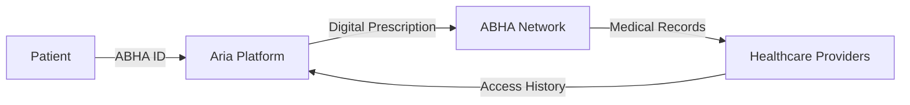

## What is ABHA?

ABHA (Ayushman Bharat Health Account) is India's official digital health ID system under the Ayushman Bharat Digital Mission (ABDM). It provides every Indian citizen with a unique 14-digit health identifier that enables seamless access to health records across the country.

<Info>
ABHA was launched by the National Health Authority (NHA) to create a unified digital health ecosystem in India.
</Info>

## Why ABHA Matters for Aria

Aria integrates deeply with ABHA to provide a secure, interoperable digital health platform that connects doctors and patients:

<Steps>
  <Step title="Unified Patient Identity">
    Every patient's medical records are linked to their unique ABHA ID, eliminating fragmentation across healthcare providers.
  </Step>
  
  <Step title="Complete Medical History">
    Doctors can instantly access a patient's complete medical history from previous consultations, prescriptions, and lab reports.
  </Step>
  
  <Step title="Seamless Record Sharing">
    Patients can securely share their medical records with any healthcare provider in the ABDM network.
  </Step>
  
  <Step title="Digital Prescriptions">
    All prescriptions generated through Aria are ABHA-linked and digitally accessible to patients forever.
  </Step>
</Steps>

## Key Benefits

### For Doctors

- **Instant Patient History**: Access complete medical records from previous consultations
- **Reduced Paperwork**: Digital prescriptions eliminate manual record-keeping
- **Better Diagnosis**: Make informed decisions with comprehensive patient data
- **Interoperability**: Exchange health records with any ABDM-compliant system

### For Patients

- **Portable Health Records**: Your medical history follows you across all healthcare providers
- **Never Lose Records**: All prescriptions and reports stored securely in the cloud
- **Easy Access**: View and download your records anytime, anywhere
- **Privacy Control**: You decide who can access your health information

<Note>
Aria's ABHA integration is fully compliant with ABDM standards and privacy regulations.
</Note>

## How It Works

1. Patients link their ABHA ID to their Aria account
2. Doctors generate ABHA-compliant digital prescriptions
3. Records are automatically synced to the patient's ABHA health locker
4. Patients can share records with any healthcare provider in the ABDM network

## Learn More

<CardGroup cols={2}>
  <Card title="Setup ABHA Integration" icon="gear" href="/integrations/abha-setup">
    Configure ABHA integration in your Aria instance
  </Card>
  
  <Card title="ABDM Integration" icon="network-wired" href="/integrations/abdm-integration">
    Understand the broader ABDM ecosystem
  </Card>
</CardGroup>

## Official Resources

- [ABHA Official Website](https://abha.abdm.gov.in/abha/v3)
- [ABDM Documentation](https://abdm.gov.in)
- [National Health Authority](https://nha.gov.in)

<Tip>
Encourage your patients to create their ABHA ID to unlock the full benefits of Aria's digital health platform.
</Tip>
